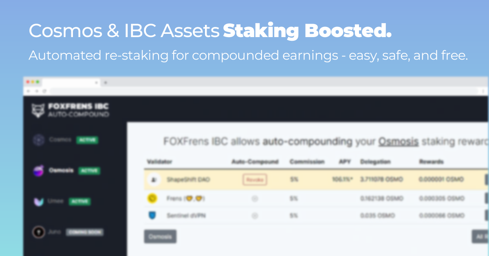

# Cosmos IBC Autostake (Auto-Compound) for Organizations

The auto-compounder makes use of a new feature in Cosmos blockchains called `Authz`. This allows a validator (or any other wallet) to send certain pre-authorized transactions on your behalf.

When you authorize the compound bot, you allow the bot to create transactions with `WithdrawDelegatorReward`  and `Delegate` only to the validator that have been approved by you - personal funds are never exposed, and the compounding bot cannot delegate to an unapproved validator. The authorisation has been set to automatically expire after four months, and you can revoke the permissions at any time.

## To-Do

- [x] Re-themed for DAOs and Organizations with multiple validator holdings
- [x] Compound APY Calculator / Guesstimator
- [ ] One-click Redelegate All to Host Validator
- [ ] Mobile Support 
- [ ] Refactor as a plugin for ShapeShift App
---

[Support this project on Gitcoin Grants.](https://gitcoin.co/grants/4836/d3-consortium-open-standards-and-resources-for-th)
